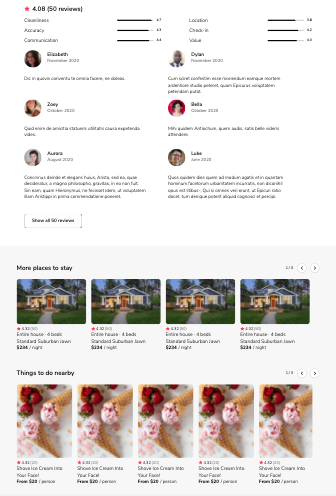

# Airbnb SOA Proxy Server

Proxy that reroutes API requests from two service-oriented architecture modules and displays bundles and data for both apps on the same page. Made with Express and Node js. Can run locally or be deployed using Amazon EC2 & S3 services.

<p align="center">

</p>

## Setup on Local

Before setting up proxy locally, complete local setup for [Reviews](https://github.com/jhou12/airbnb-soa-reviews-app) and [Carousel](https://github.com/jhou12/airbnb-soa-carousel-module) services.

1. `git clone`
1. install dependencies with `npm install`
1. in `public/index.html`, make sure both `localhost` script tags are active, and `s3` bundle scripts are commented out
1. in `server/index.js`, make sure both `localhost` middleware routes are active, and EC2 routes are commented out.
1. start server with `npm run start`
1. verify app up and running at `localhost:3000/rooms/:id` (for id values 0-99)

## Setup on EC2

Before setting up proxy on EC2, complete EC2 setup for [Reviews](https://github.com/jhou12/airbnb-soa-reviews-app) and [Carousel](https://github.com/jhou12/airbnb-soa-carousel-module) services.

1. after both services are up and running, upload each service bundle (located at `client/dist/bundle.js`) to an Amazon S3 bucket, giving each bundle a unique name
1. in each upload's "Object Actions" menu, select "Make Public"

Before creating a new EC2 instance for the proxy, edit locally first:

3. `git clone` proxy repo
1. install dependencies with `npm install`
1. in `public/index.html`, make sure both `s3` script tags are active, and `localhost` bundle scripts are commented out, and update both S3 `script src` urls with uploaded  bundle urls from step #1
1. in `server/index.js`, make sure both EC2 middleware routes are active, and `localhost` routes are commented out, and update both EC2 service routes' IPv4 addresses
1. start server with `npm run start`
1. verify proxy displays both services at `localhost:3000/rooms/:id` (for id values 0-99)

After local proxy displays S3 bundles populated with service EC2 data, create a new instance for the proxy:

9. create and launch EC2 instance with Ubuntu AMI on t2 micro (or preferred settings)
1. edit Instance Inbound Rules by adding "All Traffic" from "Anywhere," or preferred security settings
1. add pem key to root and .gitignore, and in Terminal make pem private with `chmod 400 [.pem file]`
1. connect to instance with `ssh -i "[pemKeyName].pem" ubuntu@[Public IPv4 DNS]`
NOTE: Public IPv4 address will change every time instance shuts down. To avoid repeated IP changes during development, restart instance instead of shutting down.
1. install Node on Ubuntu with:
```
curl -o- https://raw.githubusercontent.com/nvm-sh/nvm/v0.34.0/install.sh | bash
. ~/.nvm/nvm.sh
nvm install node
```
14. install Git on Ubuntu with `sudo apt-get install`
1. `git clone` proxy repo
1. install dependencies with `npm install`
1. start server with `npm run start`
1. verify app up and running at url `http://[Public IPv4 DNS]:3000/rooms/:id` (for id values 0-99).
NOTE: must use `http`, not `https`, or will return error
1. to stop instance, go to instance page and click Instance State > Stop Instance.

## Related Projects
  - [Airbnb SOA Reviews App](https://github.com/jhou12/airbnb-soa-reviews-app)
  - [Airbnb SOA Carousel Module](https://github.com/jhou12/airbnb-soa-carousel-module)
